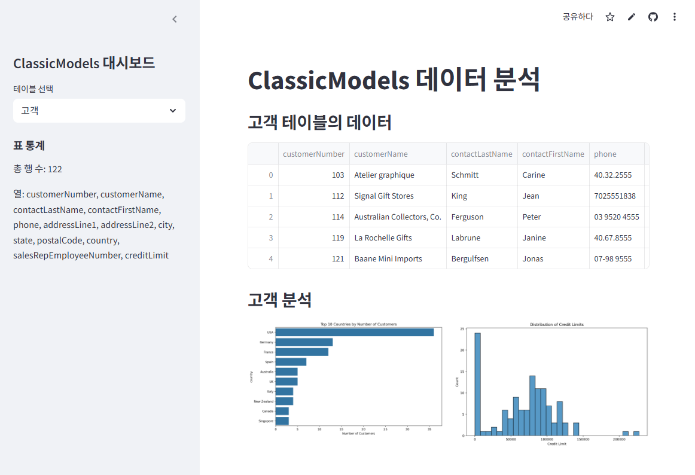

# LGU +6 프로젝트

##  📊 ClassicModels 데이터 분석
이 프로젝트는 `classicmodels.sqlite` 데이터베이스를 활용하여 Streamlit 기반의 대시보드를 구현한 것입니다. 고객, 제품, 주문, 주문 상세 테이블을 시각적으로 분석하고, 인사이트를 얻을 수 있도록 구성되어 있습니다.   
ClassicModels 데이터 분석 : https://ggw2rhcckarapqsuny4nra.streamlit.app/ "ClassicModels 데이터 분석 홈페이지 접속"

## 🔧 사용 기술

### main 
- sidebar에서 선택한 table이 보여집니다.

### sidebar
- 원하는 table을 선택할 수 있습니다.   

| table list |
|------------|
|  customers |
|  employess |
|  offices   |
|orderdeyails|
|  orders    |
|  payments  |
|productlines|
|  products  |
|    sales   |

- 표 통계

> 첫번째 미션   
>> sqlite3 생성 후, classicmodels 쿼리 추가 하는 방법   
>> stremlit 대시보드 개발   
>> sqlite3와 연결   
>> 대시보드 디자인 시작   
>> 테스트 완료 후   
>> 배포 deploy, stremlit 웹사이트   
>> README.md 페이지 구성   

